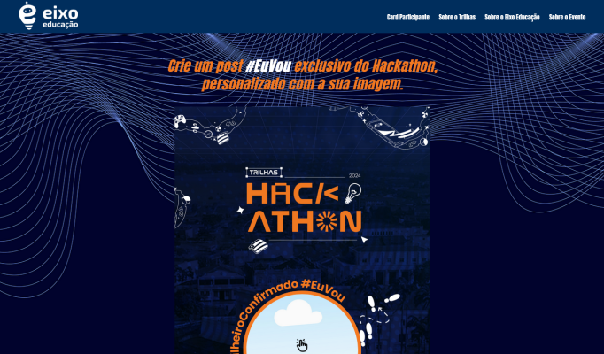

# Gerador de card #EUVOU no Hackathon do TRILHAS INOVA

Uma ferramenta para gerar cards personalizados para utilizar nas redes sociais

#EuVou #TrilhasInova #TrilheiroConfirmado #InovaMaranhão #FAPEMA

💻 publicado em <https://eu-vou-trilhas.vercel.app>

<picture>
  <source src="image.webp" srcset="public/20240823081517-f675b4c18c.gif" />
  <source src="image.webp" >
  
</picture>

<!-- 
 -->


## Desenvolvedor(es)

* Luis Eduardo Silva dos Santos (@DJEDU28) /[Autor\]
* 


## Tecnologias

<p align="center">
    <a href="https://skillicons.dev">
        
    </a>
</p>

> * [TYPESCRIPT](https://www.typescriptlang.org/) ** [REACT](https://react.dev/) ** [VERCEL](https://vercel.com) ** [VITE](https://vite.dev) ** [YARN](https://classic.yarnpkg.com/en/docs/install)


<!-- <p align="center">
    <a href="https://skillicons.dev">
        
    </a>
</p> -->

* [Styled Components](https://styled-components.com/)
* [React Hook Form](https://react-hook-form.com/)
* [LUCIDE/react](https://lucide.dev)
* [antd](https://ant.design/)
* [dom to image more](https://github.com/1904labs/dom-to-image-more/releases)
* [html2canvas](https://html2canvas.hertzen.com/)

## Para usar basta rodar

* `yarn` para baixar os pacotes
* `yarn dev`  para executar o projeto em modo desenvolvimento

se não possuir o `yarn` instalado, pode usar o `npm` ou o seu gerenciador de pacotes preferido

```bash
npm run dev
# or
yarn dev
# or
pnpm dev
# or
bun dev
```

## Inspiração

* layout do card no canva, criado pela equipe do #inovaMaranhão
* projeto similar usado no evento da [experienceLAB](https://euvou.vercel.app/)
